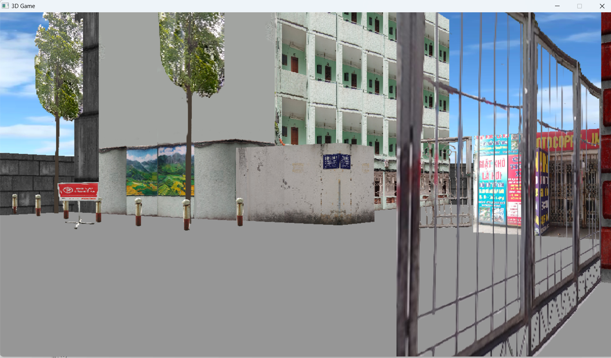
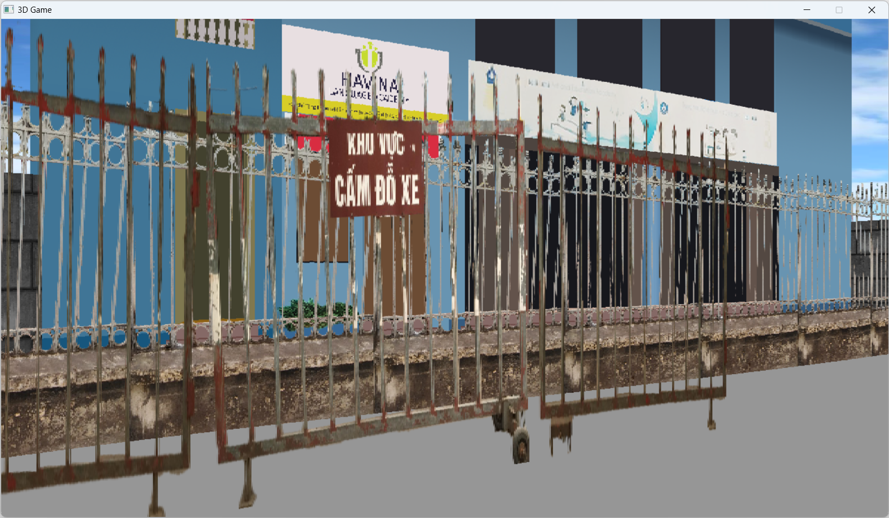

*3D Game là 1 game đến từ Bình Dương*

# 3D Game
*"Bạn tỉnh dậy rồi hả?"* - Phong

Game bắt đầu với việc bạn gặp Phong, 1 thanh niên kỳ lạ. Không biết lí do vì sao, bạn và Phong, cùng với Quân là bạn của Phong bị Isekai sang thế giới này (Có lẽ do 2 thằng xem nhiều anime quá !?). Nhiệm vụ của bạn là trở về Bình D... à nhầm UET :))

## Screenshot
<table style="padding:10px">
  <tr>
    <td width="50%"></td>
    <td width="50%"></td>
  </tr>
  <tr>
    <td width="50%"></td>
    <td width="50%"></td>
  </tr>
</table>

## Building and run
### Codeblock
 - Yêu cầu `SDL2`, `SDL2_image`, `SDL2_mixer` và `SDL2_ttf`. (Phiên bản mới nhất)
 - Codeblock version 20.03
 - Bạn có thể chạy file `Mr.exe` nếu việc build trong Codeblock có vấn đề
## Control
 - Di chuyển sử dụng 4 phím `W`,`A`,`S`,`D`, `Q` và `E` để quay.
 - Bạn cũng có thể sử dụng các phím mũi tên.
 - 1 số cửa có thể sử dụng `P` để mở (tính năng thử nghiệm nên chưa được sử dụng trong quest).
 - Khi tiến gần 1 NPC, bạn sử dụng phím `T` để bắt chuyện với họ
 - Bấm `J` để tiếp tự cuộc hội thoại. Cuối mỗi cuộc hội thoại sẽ là 1 câu trả lời được đánh số.
## Rule
 - Bạn phải giải đố để vượt qua các thử thách.
 - Mỗi map sẽ có 1 cổng dịch chuyển giúp bạn qua map mới.
 ## Credits
 - Bui Hong Quan 
 - Nguyen Dinh Tuan Anh (Họa sĩ)
 ## Reference
 - https://lodev.org/cgtutor/
 - https://lazyfoo.net/tutorials/SDL/index.php
 - [SDL Game Development](https://www.myzony.com/usr/uploads/2016/02/4127789886.pdf)
 - [sdl2-raycast](https://github.com/andrew-lim/sdl2-raycast)
 - Các hình ảnh, code khác trên internet
